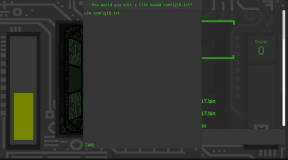

# Terminal-Hacker
You’re stuck in a dead-end CS job and enroll in an underground hacking course to make some extra cash — and finally afford that hair transplant. Dropped into a virtual system, you navigate directories and rooms using terminal commands, uncover hidden files, and ride elevators deeper into a tangled network. Your mission: collect valuable data and sell it off. But the system is watching. An anger meter tracks your mistakes and presence, growing more volatile the longer you stay. Solve mini-puzzles, find the data-rich files, and escape.

## Developers
- Brandon Yeung (byeung@udel.edu)
- Kevin Lundin (kevlund@udel.edu)
- Dhir Patel (dhirp@udel.edu)

## Basic Instructions
    Use WASD to move between rooms.
    
    Press E to interact with elevators or nearby files.
    
    Press Tab to open or close the terminal.

  Terminal Commands

    ls – View a map of the current floor.

    cd – Change directories (for puzzles).

    pwd – Show your current path and location.

    rm [filename] – Remove a file you’re touching.

    cure – Reduce system anger over time.

    help – To view more commands.
    
  File Editor

    In the terminal, type: vim <filename>

    This opens a file editor with a puzzle or clue.

    Type your answer directly into the editor.

    Then press Enter, and type one of the following to exit:

        :q – Quit

        :q! – Force quit without saving

        :w – Save

        :wq! – Save and quit
        
## Screenshot
### Terminal Interface

### Random 

### Elevator + Files

### Corrupted

### Puzzle File Editor

## Gameplay Video
1. (Coming Soon)
## Education Game Design Document
[EGDD](https://github.com/BYeungCoding/Terminal-Hacker/blob/main/docs/egdd.md)
## Credits and Acknowledgements
- links
- to
- resources
- here
